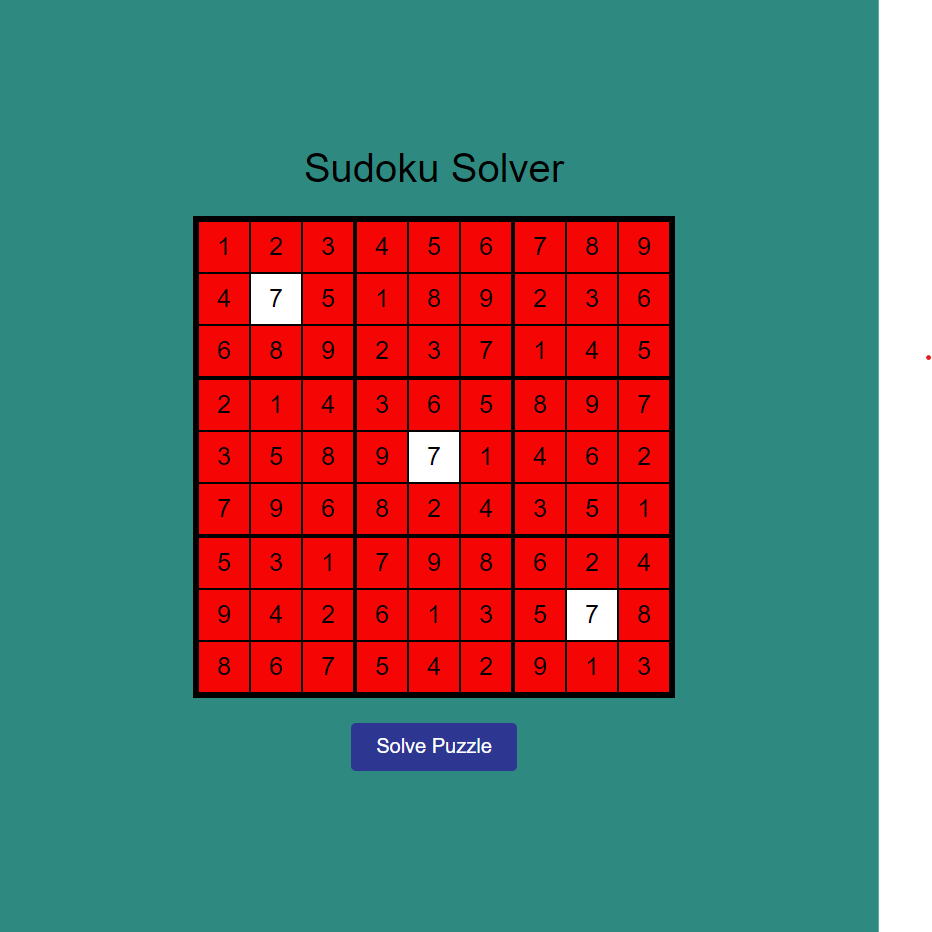

# Sudoku Solver

This project is a simple Sudoku solver implemented in HTML, CSS, and JavaScript. It provides a visual representation of the solving process and allows users to input their own Sudoku puzzles for the solver to solve.

## Usage

1. Clone the repository to your local machine:

    ```bash
    git clone https://github.com/byteSorcerer1/sudoku-solver.git
    ```

2. Open the `index.html` file in your web browser.

3. Input your Sudoku puzzle into the grid.

4. Click the "Solve" button to see the solver in action.

## Project Structure

- `index.html`: Contains the HTML structure of the Sudoku solver.
- `style.css`: Provides the styling for the Sudoku grid and animation effects.
- `script.js`: Implements the Sudoku solving logic and user interface interactions.

## How It Works

The solver uses a backtracking algorithm to fill in the Sudoku grid. The solving process is visualized with a delay for each step, providing a clear view of how the algorithm works.

## Screenshot



## Acknowledgments

This project was created as a learning exercise in building interactive web applications with JavaScript.

If you have any suggestions or questions, feel free to reach out. Happy Sudoku solving!

---

**GitHub Repository:** [byteSorcerer1/sudoku-solver](https://github.com/byteSorcerer1/sudoku-solver)
